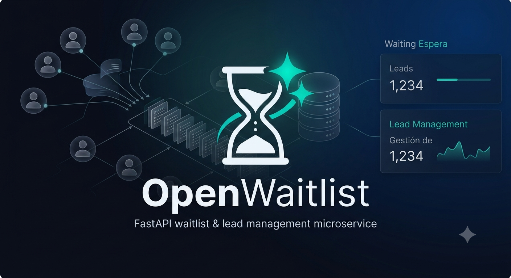

<p align="center">
  
</p>

<h1 align="center"> OpenWaitlist</h1>

<p align="center">
  <strong>Self-hosted waitlist & lead management for landing pages.</strong>
</p>

<p align="center">
  <a href="https://img.shields.io/badge/Python-3.12+-00D2B8?logo=python&logoColor=white"></a>
  <a href="https://img.shields.io/badge/FastAPI-0.115-00D2B8?logo=fastapi&logoColor=white"></a>
  <a href="https://img.shields.io/badge/React-18-00D2B8?logo=react&logoColor=white"></a>
  <a href="https://img.shields.io/github/license/iCruzDaniel/open-waitlist"></a>
  <a href="https://img.shields.io/docker/v/dcruz04/waitlistgo?color=00D2B8"></a>
  <a href="https://img.shields.io/docker/pulls/dcruz04/waitlistgo?color=00D2B8"></a>
  <a href="https://img.shields.io/github/actions/workflow/status/iCruzDaniel/open-waitlist/docker-publish.yml?color=00D2B8"></a>
  <a href="https://img.shields.io/github/v/release/iCruzDaniel/open-waitlist?color=00D2B8"></a>
  <a href="https://img.shields.io/badge/PRs-welcome-00D2B8"></a>
</p>

## Features

- **Auto-created waitlists.** POST to any slug and the waitlist is created on the spot, no pre-registration required.
- **Free-form entry data.** `entry.data` is arbitrary JSON. No forced schema, no required fields beyond what you choose to validate.
- **Dual authentication.** `X-API-Key` for public/landing endpoints. JWT for the admin panel. Never mixed on the same route.
- **Background notifications.** Email (SMTP) and webhook fire as background tasks. They never add latency to the POST response and never break it if they fail.
- **Rate limiting.** Configurable per-endpoint rate limits on entries (`POST /waitlists/{slug}/entries`) and login (`POST /auth/login`).
- **Admin panel.** React 18 + TypeScript + Tailwind + Vite, served at `/admin` from the same Docker image. No separate nginx container.
- **SQLite by default, Postgres ready.** SQLite for local dev. PostgreSQL via Docker Compose `--profile postgres` for production.
- **Multi-stage Dockerfile.** Compiles the admin panel and installs Python dependencies in builder stages. Final image runs as a non-root user with only runtime essentials.
- **Security built in.** Configurable CORS, 1 MB request body limit, Content-Security-Policy headers, and automatic sensitive-data redaction in logs.
- **Soft-delete.** Waitlists are deactivated (`is_active=false`), never physically removed.
- **Health check and robots.** `GET /health` for uptime monitoring. `/robots.txt` blocks crawlers from `/admin/`.

## Table of Contents

- [Quick Start](#quick-start)
  - [Local Development](#local-development)
  - [Docker](#docker)
- [API Reference](#api-reference)
  - [Public Endpoints](#public-endpoints-x-api-key)
  - [Admin Endpoints](#admin-endpoints-jwt)
  - [Health Check](#health-check)
  - [Adding a Lead](#adding-a-lead)
- [Configuration](#configuration)
- [Deployment](#deployment)
- [Admin Panel](#admin-panel)
- [Architecture](#architecture)
- [Notifications](#notifications)
- [Development](#development)
- [Contributing](#contributing)
- [License](#license)

## Quick Start

### Local Development

Requires Python 3.12+ and [uv](https://docs.astral.sh/uv/).

```bash
# 1. Clone and enter
git clone https://github.com/iCruzDaniel/open-waitlist.git && cd open-waitlist

# 2. Install dependencies
uv sync

# 3. Copy environment variables
cp .env.example .env

# 4. Run database migrations
uv run alembic upgrade head

# 5. Start the dev server
uv run uvicorn app.main:app --reload
```

The API is live at `http://localhost:8000`.

### Docker

**SQLite (default):**

```bash
docker compose up -d --build
```

**PostgreSQL:**

```bash
docker compose --profile postgres up -d --build
```

Requires `DATABASE_TYPE=postgres` and `DATABASE_URL=postgresql+asyncpg://...` in your `.env`.

**Logs:**

```bash
docker compose logs -f api
```

## API Reference

### Public Endpoints (`X-API-Key`)

| Method | Route | Description |
|--------|-------|-------------|
| `POST` | `/waitlists/{slug}/entries` | Add a lead. Auto-creates the waitlist if it doesn't exist. |
| `GET` | `/waitlists/{slug}/entries` | List entries (paginated with `skip` and `limit` query params). |
| `GET` | `/waitlists/{slug}/entries/export` | Export all entries as CSV. |

### Admin Endpoints (JWT)

| Method | Route | Description |
|--------|-------|-------------|
| `POST` | `/auth/login` | Authenticate. Returns a JWT. |
| `GET` | `/auth/me` | Current admin profile. |
| `GET` | `/waitlists` | List all waitlists. |
| `POST` | `/waitlists` | Create a waitlist manually. |
| `GET` | `/waitlists/{slug}` | Get waitlist details. |
| `PATCH` | `/waitlists/{slug}` | Update a waitlist. |
| `DELETE` | `/waitlists/{slug}` | Soft-delete a waitlist. |

### Health Check

```bash
curl http://localhost:8000/health
# {"status":"ok"}
```

### Adding a Lead

```bash
curl -X POST http://localhost:8000/waitlists/launch-2025/entries \
  -H "Content-Type: application/json" \
  -H "X-API-Key: changeme-api-key" \
  -d '{"email": "user@example.com", "name": "Alice", "referrer": "twitter"}'
```

Response (`201 Created`):

```json
{
  "id": 1,
  "waitlist_id": 1,
  "data": {
    "email": "user@example.com",
    "name": "Alice",
    "referrer": "twitter"
  },
  "email": "user@example.com",
  "referrer": "twitter",
  "created_at": "2025-07-30T12:00:00Z"
}
```

## Configuration

All settings are driven by environment variables. Copy `.env.example` to `.env` and edit.

| Variable | Default | Description |
|----------|---------|-------------|
| `DATABASE_TYPE` | `sqlite` | `sqlite` or `postgres` |
| `DATABASE_URL` | `sqlite+aiosqlite:///./data/waitlist.db` | SQLAlchemy async connection string |
| `API_KEY` | `changeme-api-key` | API key for public endpoints (sent via `X-API-Key` header) |
| `JWT_SECRET` | `changeme-jwt-secret` | Secret for signing admin JWTs (min 16 chars) |
| `JWT_ALGORITHM` | `HS256` | JWT signing algorithm |
| `JWT_EXPIRE_MINUTES` | `1440` | JWT token lifetime (24 hours) |
| `ADMIN_EMAIL` | `admin@example.com` | Default admin email (auto-created on startup) |
| `ADMIN_PASSWORD` | `changeme-admin-password` | Default admin password (min 8 chars) |
| `ENABLE_DOCS` | `false` | Enable `/docs` and `/redoc` |
| `ENABLE_ADMIN_PANEL` | `false` | Serve the admin panel at `/admin` |
| `RATE_LIMIT_ENTRIES` | `10/minute` | Rate limit for `POST /waitlists/{slug}/entries` |
| `RATE_LIMIT_LOGIN` | `5/minute` | Rate limit for `POST /auth/login` |
| `SMTP_HOST` | _(empty)_ | SMTP server host for email notifications |
| `SMTP_PORT` | `587` | SMTP server port |
| `SMTP_USER` | _(empty)_ | SMTP username |
| `SMTP_PASSWORD` | _(empty)_ | SMTP password |
| `SMTP_FROM` | `noreply@example.com` | Sender email address |
| `NOTIFY_EMAIL_TO` | `admin@example.com` | Recipient for new-lead email notifications |
| `WEBHOOK_URL` | _(empty)_ | Webhook URL for new-lead notifications |
| `LOG_LEVEL` | `INFO` | Python log level (`DEBUG`, `INFO`, `WARNING`, `ERROR`) |
| `LOG_SENSITIVE_REDACT` | `true` | Redact sensitive fields from log output |
| `CORS_ORIGINS` | `*` | Comma-separated allowed origins |
| `MAX_REQUEST_BODY_SIZE` | `1048576` | Max request body in bytes (1 MB) |
| `API_PORT` | `8000` | Host port for the API (Docker only) |
| `DB_PORT` | `5432` | Host port for PostgreSQL (Docker only) |

See `.env.example` for the full list with comments.

## Deployment

### DockerHub Image

The pre-built image is published at `dcruz04/waitlistgo`:

```bash
docker pull dcruz04/waitlistgo:latest
```

### Production with Docker Compose

```bash
# SQLite (simplest)
docker compose up -d

# PostgreSQL
docker compose --profile postgres up -d
```

The production compose file uses the `dcruz04/waitlistgo` image directly. The entrypoint runs Alembic migrations automatically before starting the server.

### CI/CD

The GitHub Actions workflow (`.github/workflows/docker-publish.yml`) handles everything:

1. On push to `main` or a `v*` tag, it builds the multi-stage Dockerfile and pushes to DockerHub.
2. On `main` only, a second job SSHs into the VPS, pulls the new image, and restarts the service.

Tags follow the pattern: `main`, `v1.2.3`, and the short commit SHA.

## Admin Panel

The admin panel is a React 18 + TypeScript + Tailwind + Vite app living in `admin-panel/`. When `ENABLE_ADMIN_PANEL=true`, the compiled assets are served at `/admin` from the same Docker image.

### Routes

- `/admin/login` -- Email + password login.
- `/admin/dashboard` -- Waitlist management (create, edit, soft-delete).
- `/admin/waitlist/{slug}` -- View entries, export CSV.

### Local Development (Panel Only)

```bash
cd admin-panel
npm ci
npm run dev       # Vite dev server at :5173
npm run build     # Compile for production
```

## Architecture

```
waitlistgo/
├── app/
│   ├── api/v1/           # Routers (no business logic)
│   │   ├── entries.py    #   POST entries, list, CSV export
│   │   └── waitlists.py  #   CRUD waitlists
│   ├── auth/             # API Key + JWT authentication
│   │   └── router.py     #   POST /auth/login, GET /auth/me
│   ├── core/             # Config, logging, middleware
│   ├── db/               # Async engine, session factory, Base
│   ├── middleware/        # CORS, rate limiting, security headers, body size
│   ├── models/           # SQLAlchemy models
│   ├── schemas/          # Pydantic v2 request/response schemas
│   ├── services/         # Business logic (notifications, admin bootstrap)
│   └── main.py           # FastAPI app factory
├── admin-panel/          # React + Vite admin panel
├── alembic/              # Database migrations
├── tests/                # pytest-asyncio test suite
├── .github/workflows/    # CI/CD (Docker build + VPS deploy)
├── Dockerfile            # Multi-stage (Node builder, Python builder, slim runtime)
├── docker-compose.yml    # SQLite default + PostgreSQL profile
├── docker-compose.dev.yml
└── .env.example          # All environment variables
```

## Notifications

Configure `SMTP_*` variables for email and `WEBHOOK_URL` for webhook notifications. `NOTIFY_EMAIL_TO` controls where new-lead alerts are sent.

Notifications are dispatched as background tasks the moment a new entry is created. They never block the POST response, and their failure never causes an error for the client.

## Development

### Tests

```bash
uv run pytest                  # run all
uv run pytest -v               # verbose
uv run pytest --cov=app        # with coverage
```

### Lint and Format

```bash
uv run ruff check .            # lint
uv run ruff format .           # auto-format
```

### Database Migrations

```bash
uv run alembic revision --autogenerate -m "description"
uv run alembic upgrade head
uv run alembic downgrade -1
```

## Contributing

See [CONTRIBUTING.md](CONTRIBUTING.md) for guidelines on reporting issues, suggesting features, and submitting pull requests.

## License

[MIT](LICENSE)
